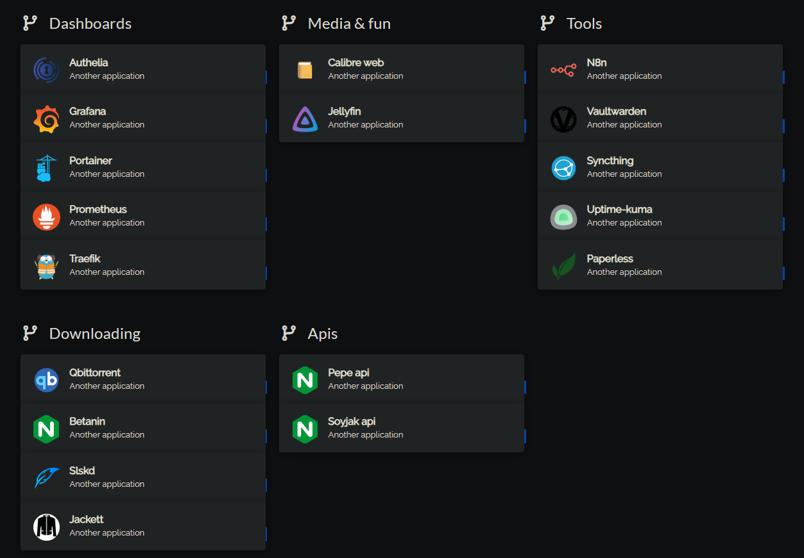
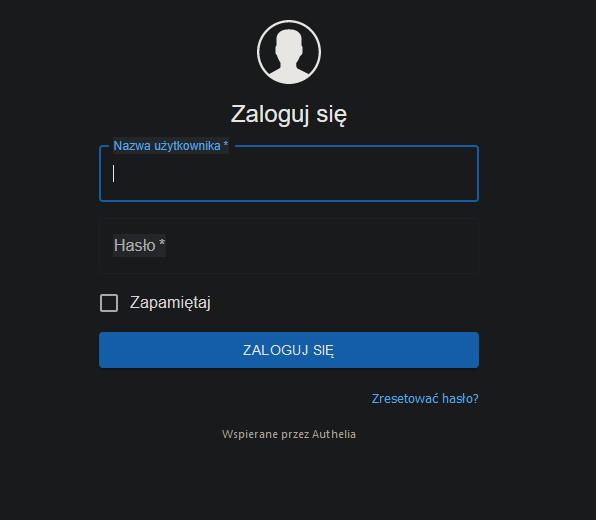
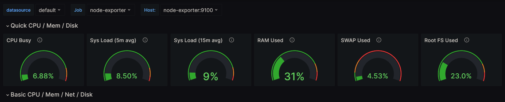

# Home Lab

Welcome to my Home Lab repository! 🏠🔬

## Description

This repository serves as a write-up and documentation for my personal Home Lab, where I explore various aspects of Linux, hosting, reverse proxy, Traefik, containers, Docker, and more. It's a playground for learning and experimenting with different technologies.




## Playbooks

Ansible playbooks for this project are available [in my repo](https://github.com/knuurr/homelab-playbooks).

## Usage

Before running the Ansible playbooks, ensure you have the following prerequisites:

1. Ansible installed on your local machine or control node.
2. Access to the target server(s) via SSH with sudo privileges.

### Main Playbook - `main.yml`
The `main.yml` playbook is the primary playbook used for provisioning and configuring your server. It provides essential setup and applies necessary configurations, including the Docker Compose files for managing containers.

To run the main playbook, use the following command:

```bash
ansible-playbook main.yml
```

This playbook will take care of setting up the server and deploying the Docker containers based on the provided configurations.

### Container Management Playbook - `manage-containers.yml`
The `manage-containers.yml` playbook allows you to perform ad hoc actions on a subset of containers. It provides tasks for restarting, stopping, starting, or recreating specific containers based on the variables specified in the playbook.

To use the container management playbook, execute the following command:

```bash
ansible-playbook manage-containers.yml
```

Please refer to the comments inside the playbook for more information on how to control which containers to manage using variables.

### Mount External Hard Drive Playbook - `mount-external-hdd.yml`
The `mount-external-hdd.yml` playbook is designed for mounting an external USB hard drive and setting up a systemd mount. Additionally, it installs Samba for file sharing. This playbook is kept separate from the main playbook to avoid unnecessary configurations for users who do not require external HDD support.

To mount an external hard drive and set up Samba, use the following command:

```bash
ansible-playbook mount-external-hdd.yml
```

Please note that if your containers rely on volumes pointing to the external HDD, you may need to restart those containers after running this playbook to ensure the correct volume paths.

## Features

>**NOTE: Writeup and actual machine configuration and playbooks are currently in a state of drift away and I'm working on general update.**


- **Reverse Proxy**: I maintain a reverse proxy on my home server using Traefik. It allows me to efficiently manage and route incoming traffic to different services.
- **SSL with Let's Encrypt**: All my services are protected with SSL encryption, thanks to Let's Encrypt. This ensures secure communication and peace of mind.


- **Containerization with Docker**: I leverage the power of Docker to encapsulate my services into containers. It provides flexibility, isolation, and easy management of individual components.

- **Single Sign-On (SSO)**: My services are protected with Single Sign-On, enhancing security and simplifying authentication for seamless user experience.


- Includes simple dashboards for system **monitoring** and **observability**.




I initially started with self-hosted home lab server as a way to experiment and learn with core DevOps technologies, including Docker, Ansible, cloud-init/Autoinstall and in some future kubernetes, for easier and automated provisioning. 

## Writeup

This writeup assumes at least some knowledge epsecially on Ansible, SSH, containers. It is more of an overview, rather than extensive walkthrough.

Entire writeup is divided into 3 parts. Each part touches different stages of deployment:

- [01 Preparing hardware + automating Linux ISO creation](01_preparing_hardware.md)
- [02 Configuring machine with Ansible](02_ansible.md)
- [03 Running self-hosted apps with Docker-Compose, along with configuring reverse proxy + SSO for all apps](03_docker.md)

### Updates

>**NOTE: because writeup and actual machine configuration and playbooks are currently in a state of drift away, I want to provide updates in a form of atomic smaller guides, while I will be working on an general update.**

- ⭐ [Configuring Traefik with Let's Encrypt DNS-01 Challenge using DuckDNS - no more self-signed cert!](traefik_plus_letsencrypt.md)
- ⭐ [Configuring Prometheus, Grafana, and node_exporter - visualise system performance easily!](grafana_dashboard.md)
- ⭐ [Automating Ubuntu ISO creation and installation with cloud-init, AUtoinstall and PXEless docker image](iso_autoinstall.md)


I've made such division because I suspect not everyone may be interested in whole walkthrough, and is just interested in part of it. Besides that, keeping it all in 1 document would result in a very long file, which would be hard to come back to later (for you) and maintain (for me).

Anyway, I hope this repo will be useful for you, epsecially if you're only entering the world of self-hosted.


If you're passionate about learning and experimenting with technologies like Linux, hosting, reverse proxy, containers, and Docker, join me in this exciting journey! Don't forget to star this repository and feel free to contribute by sharing your own insights, ideas, or improvements.

Let's connect and dive into the world of home lab setups together! 🚀


