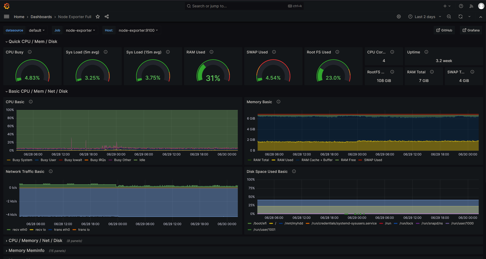
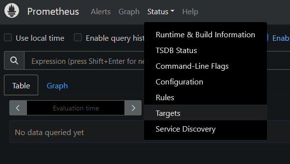
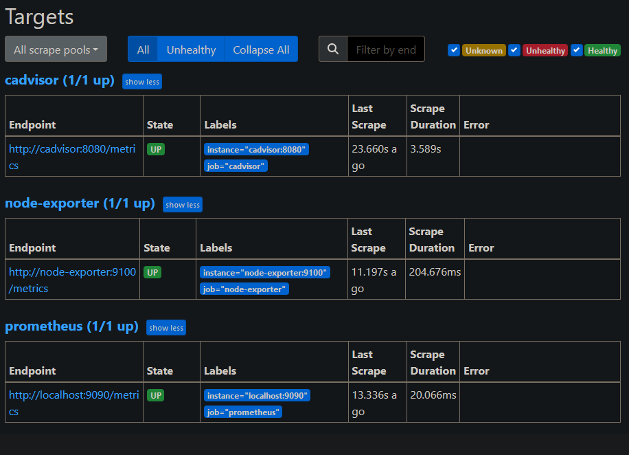
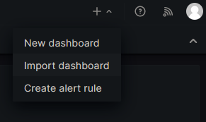
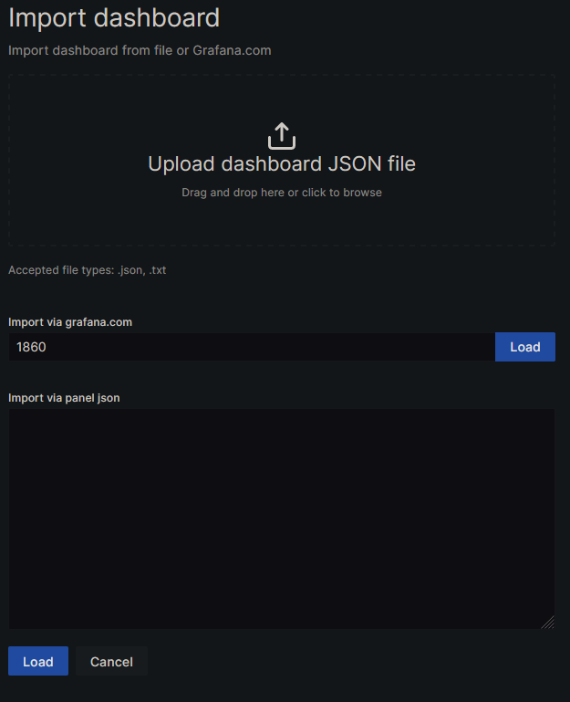

# Configuring Prometheus, Grafana, and node_exporter using Docker Compose


This guide will help you configure Prometheus, Grafana, and node_exporter using Docker Compose. Prometheus is a monitoring and alerting tool, Grafana is a visualization platform, and node_exporter is a Prometheus exporter for system metrics.



## Summary

After completing the steps in this guide, you can expect to have a fully functional monitoring setup with Prometheus, Grafana, and node_exporter. Prometheus will collect metrics from the `node_exporter` and Grafana will provide a web-based interface to visualize the metrics.

## Step 1: Prepare Prometheus Docker Compose

Create a `docker-compose.yml` file. I will use the same battle-tested one I use for my homelab, with necessary Traefik configuration:

```yaml
version: "3.3"
networks:
  backend:
    external: true

services:
  prometheus:
    image: prom/prometheus
    # Not ideal, but quick-fix to fix some permission issues
    user: root # https://stackoverflow.com/questions/74810089/err-open-prometheus-queries-active-permission-denied
    container_name: "prometheus"
    volumes: 
      - "./config/prometheus/:/etc/prometheus"
      - "/opt/prometheus:/prometheus"
    command:
      - '--config.file=/etc/prometheus/prometheus.yml'
      - '--storage.tsdb.path=/prometheus'
      - '--storage.tsdb.retention.size=256MB'
      - --storage.tsdb.retention.time=21d
    labels:
      - "traefik.enable=true"
      - "traefik.http.routers.${SERVICE_NAME}.rule=Host(`${SUBDOMAIN}.${ROOT_DOMAIN}`)"
      - "traefik.http.services.${SERVICE_NAME}.loadbalancer.server.port=${PORT}"
      - "traefik.http.routers.${SERVICE_NAME}.tls=true"
      - "traefik.http.routers.${SERVICE_NAME}.middlewares=authelia@docker"
    networks:
      - backend
    security_opt:
      - no-new-privileges:true
    restart: unless-stopped
```

And supplementary `.env` file for Docker-Compose:

```ini
ROOT_DOMAIN='domain.local'
SUBDOMAIN='prometheus'
PORT=9090
SERVICE_NAME="prometheus"
```

This declaration configures necessary labels for Traefik, volumes ofr persistent data, some commands for `prometheus` configuration. In my scenario, common `network` for all other containers is very important becausse they will communicate through dedicated internal docker network, via Docker's internal DNS resolver.

It also mounts the `prometheus.yml` and `alert.rules` files as volumes inside the container, allowing Prometheus to use the specified configuration and alert rules.

## Step 2: Prepare prometheus.yml for node_exporter

This configuration file specifies the global settings and scrape configurations for Prometheus.

Create a `prometheus.yml` file with the following contents:

```yaml
global:
  scrape_interval: 30s

scrape_configs:
  - job_name: node-exporter
    static_configs:
      - targets: ['node-exporter:9100']
```

The `scrape_configs` section defines a job named `node_exporter` with a single target, `node-exporter:9100`. This configuration instructs Prometheus to scrape metrics from the `node_exporter` service running on the host named `node-exporter` on port `9100`.


## Step 3: Prepare alert.rules for Prometheus (optional)

This file contains custom alert rules for Prometheus. Alert rules define conditions based on collected metrics that trigger alerts

These rules are *optional* and depend on your specific monitoring requirements. You can define alerts for various metrics and set appropriate thresholds and actions to be taken when those thresholds are breached.


## Step 4: Prepare node-exporter Docker Compose

This configuration file defines the `node_exporter` service. It maps the `node_exporter` port `9100` to the host system, allowing Prometheus to scrape metrics from it.

Create a `docker-compose.yml` file for node_exporter with the following contents:

```yaml
version: "3"

networks:
  backend:
    external: true

services:
  node-exporter:
    image: quay.io/prometheus/node-exporter:latest
    container_name: node-exporter
    volumes:
      - /proc:/host/proc:ro
      - /sys:/host/sys:ro
      - /:/rootfs:ro
    command:
      - '--path.procfs=/host/proc'
      - '--path.rootfs=/rootfs'
      - '--path.sysfs=/host/sys'
      - '--collector.filesystem.mount-points-exclude=^/(sys|proc|dev|host|etc)($$|/)'
    expose:
      - 9100
    restart: unless-stopped
    networks:
      - backend

```
It mounts some important firtual filesystem endpoint inside container, necessary to perform check on system status. `backend` network is the same as for Prometheus, so each container can find each other through internal Docker DNS.

NOTE: as you see, entire filesystem is mounted under container as read-only `/:/rootfs:ro`. 

## Step 5: Prepare Grafana Docker Compose

Create a `docker-compose.yml` file for Grafana with the following contents:

```yaml
version: "3.3"

networks:
  backend:
    external: true


services:
  grafana:
    image: grafana/grafana
    container_name: "grafana"
    #  Not ideal
    user: root # https://community.grafana.com/t/mkdir-cant-create-directory-var-lib-grafana-plugins-permission-denied/68342/31
    volumes:
      - "/opt/grafana/:/var/lib/grafana"
    environment:
        # I use SSO middleware, so I don't need that
      - GF_SECURITY_DISABLE_INITIAL_ADMIN_CREATION="true"
        # Disable analytics   
      - GF_ANALYTICS_REPORTING_ENABLED=false
    labels:
      - "traefik.enable=true"
      - "traefik.http.routers.${SERVICE_NAME}.tls=true"
      - "traefik.http.routers.${SERVICE_NAME}.rule=Host(`${SUBDOMAIN}.${ROOT_DOMAIN}`)"
      - "traefik.http.routers.${SERVICE_NAME}.service=grafana"
      - "traefik.http.routers.${SERVICE_NAME}.middlewares=authelia@docker"
      - "traefik.http.services.${SERVICE_NAME}.loadbalancer.server.port=${PORT}"
    networks:
      - backend
    restart: unless-stopped
```

And supplementary `.env` file for Docker-Compose:

```ini
ROOT_DOMAIN='domain.local'
SUBDOMAIN='grafana'
PORT=3000
SERVICE_NAME="grafana"
```

If you don't have authentication middleware like I do for Traefik (Authelia provides SSO for all apps), you may want to set `GF_SECURITY_DISABLE_INITIAL_ADMIN_CREATION` to `false`.


## Step 6: Start the Applications in Order

Start the applications. From my experience, it's good if `prometheus` will be first:

1. Prometheus: `docker-compose up -d prometheus`
2. node_exporter: `docker-compose up -d node-exporter`
3. Grafana: `docker-compose up -d grafana`

## Step 7: Verify Prometheus Configuration

Visit the Prometheus web UI, either at `http://<IP>:9090` where IP is IP of your remote server or if You use reverse proxy like I do at `http://prometheus.domain.local` and verify that Prometheus can scrape metrics from the node_exporter. You should see the `node_exporter` job listed under "Targets"





## Step 8: Install the Node Exporter Full Dashboard in Grafana

Visit the Grafana web interface either at `http://<IP>:3000` where IP is IP of your remote server or if You use reverse proxy like I do at `http://grafana.domain.local` and log in (the default username and password is `admin`).

1. Click on the "+" icon on the left sidebar and select "Import"


2. In the "Import via grafana.com" section, enter `1860` in the "Grafana.com Dashboard" field. This is taken from [Grafana website here](https://grafana.com/grafana/dashboards/1860-node-exporter-full/), and this of course can be any other dashboard, but I found this one extremely capable out-of-the-box.
3. Click "Load" to load the Node Exporter Full dashboard.



4. Adjust the settings as desired and click "Import" to import the dashboard.

## Step 9: Everything is Ready!


At this point, you have successfully configured Prometheus, Grafana, and node_exporter using Docker Compose. You can now explore the metrics and visualizations in Grafana and set up additional dashboards and alerts as needed.

That's it! You now have a complete monitoring setup with Prometheus, Grafana, and node_exporter. Feel free to customize the configuration files and add more services as per your requirements.

