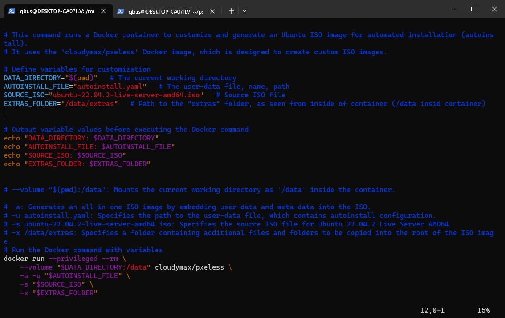
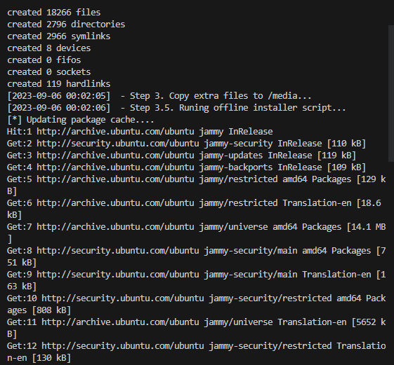
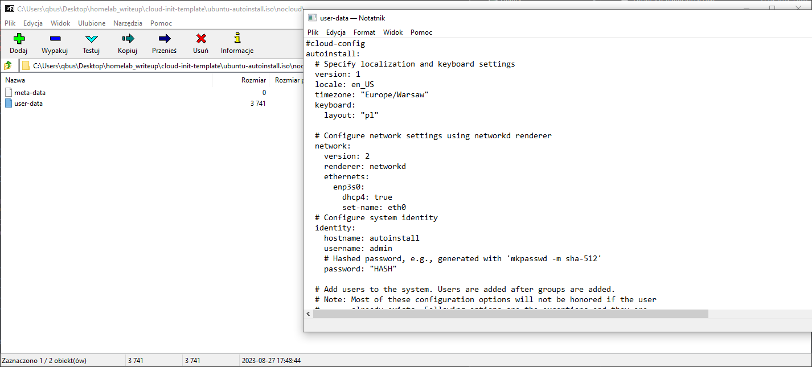
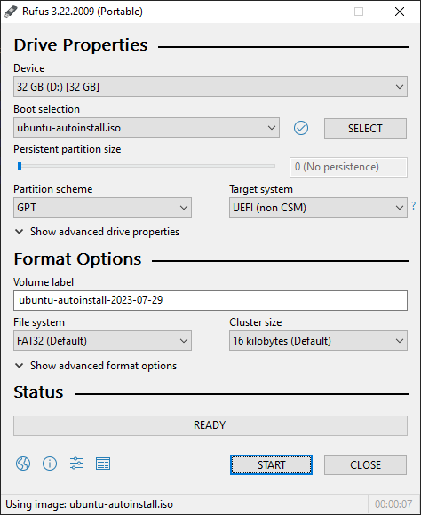
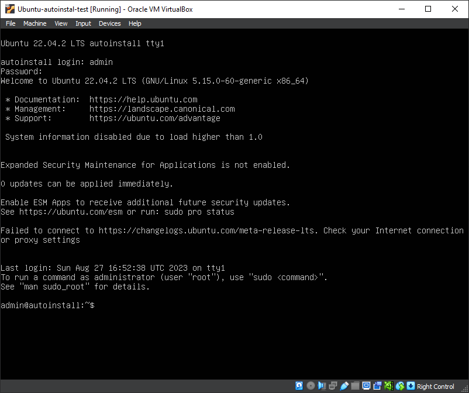
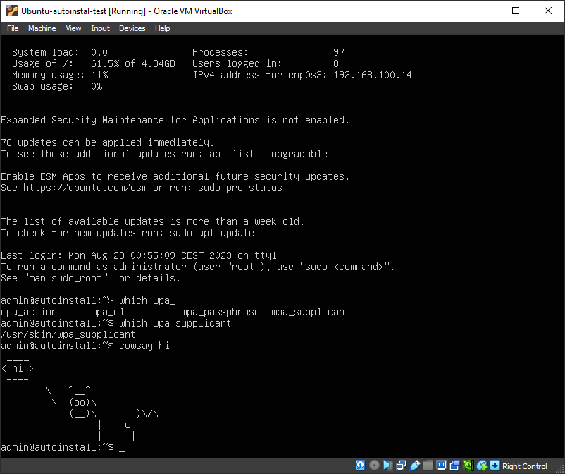

# Provisioning an ISO Image using cloud-init, Autoinstall, and PXEless

## Introduction

In this tutorial, we will explore the process of provisioning an ISO image for automated system installation. We'll make use of technologies like cloud-init, Autoinstall, and the PXEless tool provided by cloudymax.

### What is cloud-init?

Cloud-init is a widely used package for configuring and initializing cloud instances. It's often used in cloud environments to set up instances on first boot, including setting metadata, user accounts, SSH keys, and more.

### What is Subiquity?

Subiquity is a server installer for Ubuntu that uses cloud-init under the hood. It provides a more modern and user-friendly installation experience compared to the traditional Debian Installer. Subiquity simplifies the installation process while still supporting advanced features through cloud-init.

### What is PXEless?

[cloudmax/PXEless](https://github.com/cloudymax/pxeless) is an automated  image-creation tool. It generates customized Ubuntu auto-install ISO images using cloud-init and Ubuntu's Subiquity installer.

#### Additional Resources

Check my [GitHub repository](https://github.com/knuurr/automate-iso-provisioning) for examples of Subiquity files that set up WiFi networks, SSH keys, admin users, and Ansible users.


## Getting Started

### Preparing autoinstall files

For autoinstaller, we need to declaratively provide what configuration of destination system we want to achieve.

On my Github I provide an entire template I use for my own system. There are also materials online about creating your very own customized and ideal file and all possibilities. I just want to briefly explain some blocks from my own:

```yaml
#cloud-config
autoinstall:
  version: 1
  locale: en_US
  timezone: "Europe/Warsaw"
  keyboard:
    layout: "pl"
```

This block of configuration sets the system's locale, timezone, and keyboard layout for the autoinstall process using cloud-init.

```yaml
  network:
    version: 2
    renderer: networkd
    ethernets:
      enp3s0:
        dhcp4: true
        set-name: eth0
```

This section configures network settings using systemd-networkd, enabling DHCP for the specified Ethernet interface.
This file uses 1:1 Netplan syntax, so Netplan config syntax is the same as what you'd put there.

In this case, `enp3s0` Ethernet interface will be configured (so ok for cable connected machine, but also for i.e. for Proxmox). 

I cover Wifi case later down this tutorial.

```yaml
  identity:
    hostname: unattended
    username: admin
    password: "HASH"
```
Summary: This part defines system identity settings, including the hostname, initial username, and hashed password for the "admin" user.

On Linux systems, you can use the `mkpasswd` command (provided by the `whois` package) to generate password hashes. Install it if it's not already available:


```bash
sudo apt-get install whois
```
Then, generate a password hash:


```bash
mkpasswd -m sha-512
```

You'll be prompted to enter the password, and the hashed password will be displayed.


```yaml
  user-data:
    users:
      - name: ansible
        gecos: Ansible User
        sudo: "ALL=(ALL) NOPASSWD:ALL"
        groups: sudo
        lock_passwd: true
        shell: /bin/bash
        ssh_authorized_keys:
          - "ssh-rsa <KEY>"
```

Summary: This block specifies user-related configurations, including creating a user named "ansible" with sudo privileges and an SSH public key for easier management.


To generate an SSH key hash (fingerprint), you can use the `ssh-keygen` command:

```bash
ssh-keygen
```

```yaml
  ssh:
    install-server: true
    authorized-keys:
      - <PUB KEY>
    allow-pw: false
```

This block enables and configures SSH settings for the system. In our case, affected user will be "admin". 
Procedure with public key is the same as previously.

```yaml  
  # interactive-sections:
    # - network
    # - storage
```
This block specifies a list of configuration keys that should still be visible in the system's user interface (UI) during the installation process.

In this example, the comment provides instructions on how to use the interactive-sections key to select specific configuration sections (such as "network" and "storage") that should be displayed to users in the installation UI.

I just want to mention it in case you had problem with expressing as code.


### Preparing autoinstall files - special case for Wifi support

I had troubles with getting Wifi support for my machine. That's because using fully unattended setup, `wpa_supplicant` package wouldn't be installed on target host. Also network configuration wouldn't be copied over.

I'm not sure whether it's related to PXEless or Subiquity (note that these methods are suitable for cloud, where normally cable network interace is virtualised and taken for granted) but I came up with a dirty fix for my Wifi machine.

First prepare network configuration in netplan-supported format for Wifi. Here's exmaple of mine:

```yaml
network:
  version: 2
  renderer: networkd
  wifis:
    wlp2s0:
      dhcp4: no
      dhcp6: no
      addresses: [192.168.100.200/24]
      nameservers:
        addresses: [192.168.100.1, 8.8.8.8]
      access-points:
        "NET-SSID":
          password: "PLAINTEXT"
      routes:
        - to: default
          via: 192.168.100.1
```

Save it to file, for example `10-wifi.yaml`. Same can go into Subiquity autoinstall file.

Here I describe all necessary info for my machine to connect to Wfi router. Note that network name and password are plaintext.
I also use static address, but DHCP is always an option.

```yaml
runcmd:
  - netplan apply
  - ip link set wlp2s0 up
```

This block defines a list of commands to be executed after the initial system setup.

`netplan apply`: This command applies network configuration changes made via Netplan. It ensures that any network configuration changes take effect immediately.
`ip link set wlp2s0 up`: This command brings up the network interface named "wlp2s0," activating it for network communication.


```yaml
late-commands:
  - date >> /target/etc/birth_cert
  - rm -f /target/etc/netplan/*
  - cp /media/10-wifi.yaml /target/etc/netplan/10-wifi.yaml
  ```

This block specifies a list of commands to be executed late in the installation process, typically after the initial system setup.

- `date >> /target/etc/birth_cert`: This command appends the current date and time to a file named "birth_cert" located in the /etc directory of the installed system. It can be used for timestamping. (not needed in our case, but I left it because I think it's cool anyway)
- `rm -f /target/etc/netplan/*`: This command removes all files in the `/etc/netplan` directory of the installed system. It is used to clear any existing network configuration files in that directory.
- `cp /media/10-wifi.yaml /target/etc/netplan/10-wifi.yaml`: This command copies a file named "`10-wifi.yaml`" from the `/media` directory to the `/etc/netplan` directory of the installed system. This action likely sets up custom network configuration.


We can copy our previously prepared configuration, because thanks to PXEless we can copy arbitrary files to out host, baked into our ISO image.

And now here are two choices you have.


1) You can either setup template so that Network section of installation will popup on screen during install - this makes it not so unattended, but in mace, this made Ubuntu installer load `wpa_supplicant` package.

To achieve that, I leave `network` as the only interactive session I will have.

```yaml
  interactive-sections:
  - network
```

For my workaround, during setup I had to manually on network setup screen let Ubuntu installer detect Wfi interface, and *only then* would `wpa_supplicant` be installed alongside with OS, needed for wifi support on Linux.

2) There is second option. **PXEless has an option to run `.sh` bootstrap script** to customize our image further using `--offline-installer` option, with all commands inside script executed and commited to ISO image.

**This allows us to install arbitrary package (or taking it further, launch arbitrary changes to image).**

PXEless provides us with exmaple script [in their repo](https://github.com/cloudymax/pxeless/blob/develop/extras/installer-sample.sh). If you want it to work, stick to this template. For example, I discarded network settings from this template and wondered why it doesn't work.

Here's a script modified for my purposes. To show it works along `wpasupplicant` will install `cowsay` package. You can find my script in github repo with other templates.

```bash
echo 'nameserver 8.8.8.8' > /etc/resolv.conf

# # Update the apt package cache since it's not present on the ISO by default
echo '[*] Updating package cache....'
apt-get update
echo '[*] Package cache updated'

# # List of packages to be installed during build
echo '[*] Installing packages....'
apt-get install -y \
    wpasupplicant \
    cowsay
echo '[*] Packages installed'

# # Clean the apt-package cache to prevent stale package data on install
# # as well as prevent inflating the image size
echo '[*] Cleaning package cache....'
apt-get clean
echo '[*] Package cache cleaned'

# # Remove our changes to the resolv.conf file
echo ' ' > /etc/resolv.conf

# # Clear the history before exiting avoids leaking potentially sensitive data
echo '[*] cleaning DNS and history....'
echo ' ' > /etc/resolv.conf

history -c

exit
```

If we have script, we can progress to baking process.

### Clone the PXEless Repository

To begin, clone the PXEless repository to your local machine:

```bash
git clone https://github.com/cloudymax/pxeless.git
```

Change your current working directory to the root of the PXEless repository:

```bash
cd pxeless
```

Since PXEless assumes you will be working from downloaded directory's folder, I suggest you to build Docker image from cloned repo:

```bash
docker build -t cloudymax/pxeless .
```

This way you will not be forced to keep eveything in folder together with cloned repo.

## Provisioning an ISO Image

Now, let's generate an ISO image for automated system installation.

### Using Docker

We'll use Docker to create the ISO image with the necessary configurations.

Because inside Virtualbox I cna;t emulate Wifi, let's pick template for Ethernet connection and try to apply bootstrap script to it.

#### Docker Command

```bash
docker run --privileged --rm \
    --volume "$(pwd):/data" cloudymax/pxeless \
    -a -u autoinstall.yaml \
    -s ubuntu-22.04.2-live-server-amd64.iso \
    -x /data/extras \
    --offline-installer installer-sample.sh
```

Explanation of the Docker command. These commands assume paths used by exmaples provided by me:

- `--privileged`: Provides necessary permissions to the container.
- `--rm`: Removes the container after execution.
- `--volume "$(pwd):/data"`: Mounts the current working directory as '/data' inside the container.
- `-a`: Generates an all-in-one ISO image by embedding user-data and meta-data into the ISO.
- `-u ./template-eth/autoinstall-eth.yaml`: Specifies the path to the user-data file, which contains autoinstall (Subiquity) configuration.
- `-s ubuntu-22.04.2-live-server-amd64.iso`: Specifies the source ISO file for Ubuntu 22.04.2 Live Server AMD64. You download it separately from [https://ubuntu.com/download/server](Ubuntu website).
- `-x /data/template-eth/extras`: Specifies a folder containing additional files and folders to be copied into the root of the ISO image.
- `--offline-installer installer-sample.sh`: Bootstrap scirpt which will run shell script inside ISO just as it was a running system, and will later commit those changes to bootable ISO. Contianer assumes that script must be put in `extras` folder.


Note that, in example I put on github, I've put everything into single script and decoupled key settings into multiple variables.

This allows me to keep multiple version of script, together with multiple Subiquity templates for different machines or different scenarios.





Baking process is very verbose. In my example, I used bootstrap script, and I can see `apt` commands being run in terminal:



After running the script, we can verify that out configuration is in fact baked into ISO. Here I use 7-zip.





### Flashing the ISO Image

Once you've generated the ISO image, you can flash it to a USB drive using a tool like Rufus on a Windows machine. Follow these steps:

1. Download and install Rufus from [https://rufus.ie/](https://rufus.ie/).

2. Insert a USB drive into your Windows machine.

3. Open Rufus and select the USB drive as the target device.

4. In the "Boot selection" section, click "Select" and choose the ISO image you generated.

5. Configure any additional settings as needed.

6. Click "Start" to begin flashing the ISO image to the USB drive.




## Unattended Installation

After flashing the ISO to the USB drive, you can use it for unattended installations on target machines.

**NOTE: WHEN USB PLUGGED AND BOOTED FROM, IT WILL WIPE YOU TARGET MACHINE! BE AWARE OF THAT, THERE WILL BE NO QUESTIONS ASKED!**

1. Insert the USB drive into the target machine.

2. Boot the machine from the USB drive (you may need to adjust BIOS settings to prioritize booting from USB).

3. The installation process will proceed automatically based on the configurations you provided in the user-data file.

4. Sit back and let the system install without manual intervention.


Congratulations! You've successfully provisioned an ISO image for automated system installation using cloud-init, Autoinstall, and PXEless.

Feel free to customize the configurations and explore further possibilities with automated system provisioning.

here I succesfully log in to my VM with "admin:admin" credentials (as provided in example files):




If you opt for my example bootstrap script, you can also verify that packages are installed onto system, and I can freely use `cowsay`:



My templates for this project are available at: https://github.com/knuurr/automate-iso-provisioning