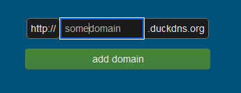
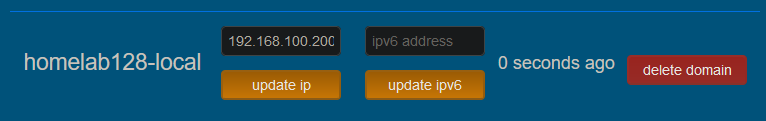
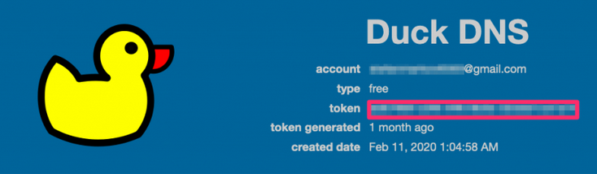
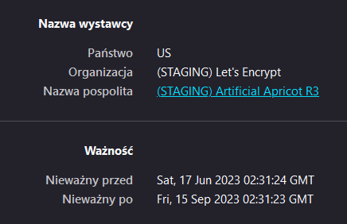
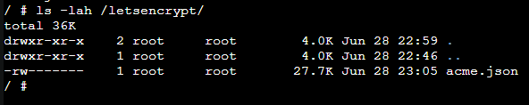
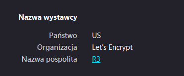

<<<<<<< Updated upstream

# Configuring Traefik with Let's Encrypt DNS-01 Challenge using DuckDNS

This guide will help you configure Traefik to use the DNS-01 challenge method with Let's Encrypt certificates using DuckDNS as the DNS provider.

## Prerequisites

Before proceeding with the configuration, make sure you have the following:

- Docker installed
- Docker Compose installed
- A registered domain with DuckDNS
- A DuckDNS API key

## Step 1: Prepare Traefik Docker Compose File

Create a `docker-compose.yml` file for Traefik. For this tutorial I will use my file as exmaple which is battle-tested in my homelab. Your's may look different, but I will explain key points below for easy adaptability.

```yaml
version: "3.3"

services:
  traefik:
    image: "traefik:v2.9"
    container_name: "traefik"
    restart: always
    security_opt:
      - no-new-privileges:true
    environment:
    # DuckDNS Api token
      - DUCKDNS_TOKEN=${DUCKDNS_TOKEN}
    ports:
      - "80:80"
      - "443:443"
    volumes:
      - "/var/run/docker.sock:/var/run/docker.sock:ro"
      - "/opt/traefik:/etc/traefik"
    #  Let's Encrypt cert persistent storage location
      - "/etc/letsencrypt:/letsencrypt"
      - "/etc/traefik/traefik.yml:/etc/traefik/traefik.yml"
    labels:
      - "traefik.enable=true"
      - "traefik.http.routers.${SERVICE_NAME}.service=api@internal"
      - "traefik.http.routers.${SERVICE_NAME}.rule=Host(`${SUBDOMAIN}.${ROOT_DOMAIN}`)"
      # Enable SSL
      - "traefik.http.routers.${SERVICE_NAME}.tls=true"
      - "traefik.http.routers.${SERVICE_NAME}.tls.certresolver=duckdns"
      - "traefik.http.routers.${SERVICE_NAME}.tls.domains[0].main=${ROOT_DOMAIN}"
      - "traefik.http.routers.${SERVICE_NAME}.tls.domains[0].sans=*.${ROOT_DOMAIN}"
      # Authelia
      - "traefik.http.routers.${SERVICE_NAME}.middlewares=authelia@docker"
```

And supplementary `.env` file for Docker-Compose:

```ini
ROOT_DOMAIN='domain.local'
SUBDOMAIN='traefik'
SERVICE_NAME="api"
DUCKDNS_TOKEN="token-value"
```


Here are key takeaways:

- here goes DuckDNS API token. This is needed for DNS-01 challenge using DuckDNS. You can either hardcode it inside `docker-compose.yml` file, or outsource it so separate `.env` file.

```yaml
    environment:
    # DuckDNS Api token
      - DUCKDNS_TOKEN=${DUCKDNS_TOKEN}
```

- You need a way to store Let's Encrypt provided file. Here I example from my `docker-compose.yml`, where I specify config setting, epxose docker.sock AND finally persistent storage for ;et's Encrypt cert, located in `/etc/letsencrypt` externally and `/letsencrypt` inside container.

```yaml
    volumes:
      - "/var/run/docker.sock:/var/run/docker.sock:ro"
      - "/opt/traefik:/etc/traefik"
    #  Let's Encrypt cert persistent storage location
      - "/etc/letsencrypt:/letsencrypt"
```

- labels for cert fetching. Now, I must admit that this is glued together from different sources so I am not entirely certain how exactly it works (and I do not find Traefik documentation clear enough) but thje most important for me - it works.

```yaml
    labels:
      - "traefik.enable=true"
      # Enable SSL
      - "traefik.http.routers.${SERVICE_NAME}.tls=true"
      - "traefik.http.routers.${SERVICE_NAME}.tls.certresolver=duckdns"
      - "traefik.http.routers.${SERVICE_NAME}.tls.domains[0].main=${ROOT_DOMAIN}"
      - "traefik.http.routers.${SERVICE_NAME}.tls.domains[0].sans=*.${ROOT_DOMAIN}"
```

You can either keep your domain as env variable like I do, where it's kept in `.env` file or hardcode it inside compose declaration. `main` stands for root domain - let's say `exmaple.duckdns.org` and sans will be for wildcard certificate, so fetched cert will match wildcard `*.exmaple.duckdns.org` so we can host our services under different subdomain each.

## Step 2: Prepare Traefik Static Configuration File

Modify `traefik.yml` file with the following contents:

- (optionall, but may help) adapt log verbosity for easy debugging of process

```yaml
# (Optional) Log information
# ---
log:
  level: DEBUG  # DEBUG, INFO, WARNING, ERROR, CRITICAL
```

- configure certificate resolver section:

```yaml
certificatesResolvers:
  dnschallenge:
    acme:
      email: YOUR_EMAIL
      storage: "/letsencrypt/acme.json"
        # caServer is for staging certificate - useful for testing  
      caServer: https://acme-staging-v02.api.letsencrypt.org/directory
      dnsChallenge:
        provider: duckdns
        delayBeforeCheck: 30
        resolvers:
          - "1.1.1.1:53"
          - "8.8.8.8:53"
```

- Replace `YOUR_EMAIL` with your email address you want to associate with Let's Encrypt.
- `storage` matches path to Let's Encrypt cert, as seen from inside Traefik container.
- `resolvers` are DNS servers which will be used during DNS challenge. I choose these because I believe these are reliable and will have any DNS changes, here TXT change, relatively quickly.

By specifying the staging server as the `caServer`, Traefik will communicate with the staging server and issue test certificates. This helps prevent any accidental rate limit hits or certificate revocations during the configuration process. I encourage to remove/comment out this line only if you have tested configuration

## Step 3: Create a DuckDNS Account and Domain

If you haven't already, create a DuckDNS account at [https://www.duckdns.org](https://www.duckdns.org). Once you have an account:

1. Log in to your DuckDNS account.
2. Create a domain and note down the domain name (e.g., `example.duckdns.org`).
3. For homelab, I associate my domain with local IP address on my LAN network.




## Step 4: Point the DuckDNS Domain to Your Local IP

In your DuckDNS dashboard:

1. Navigate to the domain you created in the previous step.
2. Find the "current ip" field.
3. Enter your local IP address (e.g., `192.168.1.100`) in the field.
4. Save the changes using "update ip".




## Step 5: DuckDNS API Key

API key for DuckDNS is visible on top of site after login.



## Step 6: Input the DuckDNS API Key as an Environment Variable

Open the `docker-compose.yml` file created in Step 1 and replace input DuckDNS token:

```yaml
    environment:
    # DuckDNS Api token
      - DUCKDNS_TOKEN=token-value
```

## Step 7: Start Traefik

After uploading the config and new docker-compose file to remote server, either start or restart Traefik:

```bash
docker-compose up -d
```

## Step 8: Wait for Certificate Generation

Wait for a few moments to allow Traefik to generate the Let's Encrypt certificate using the DNS-01 challenge with DuckDNS. You can monitor the progress in the Traefik logs.

## Step 9: Verify the Certificate

Once Traefik has obtained the certificate, you can verify it by accessing your domain over HTTPS in a web browser. If the certificate is valid, you have successfully configured Traefik with Let's Encrypt DNS-01 challenge using DuckDNS.

if you configured it to use staging certificate (for testing), after some time you'll see that your domain uses TLS cert issued by "(STAGING) Let's Encrypt". This certificate will also generate browser warning about untrusted certificate.



If you are ready to switch to production certificate, **just remove previously fetched staging certificate at `/etc/letsencrypt` on remote server** and restart Traefik container.
After some time, if previous configuration worked properly, Traefik should fetch new certificate which will be trusted by major modern browsers automatically.






---

That's it! You have successfully configured Traefik to use the DNS-01 challenge method with Let's Encrypt certificates using DuckDNS as the DNS provider. Feel free to adjust the configuration files and commands based on your specific requirements.
=======

# Configuring Traefik with Let's Encrypt DNS-01 Challenge using DuckDNS

This guide will help you configure Traefik to use the DNS-01 challenge method with Let's Encrypt certificates using DuckDNS as the DNS provider.

## Prerequisites

Before proceeding with the configuration, make sure you have the following:

- Docker installed
- Docker Compose installed
- A registered domain with DuckDNS
- A DuckDNS API key

## Step 1: Prepare Traefik Docker Compose File

Create a `docker-compose.yml` file for Traefik. For this tutorial I will use my file as exmaple which is battle-tested in my homelab. Your's may look different, but I will explain key points below for easy adaptability.

```yaml
version: "3.3"

services:
  traefik:
    image: "traefik:v2.9"
    container_name: "traefik"
    restart: always
    security_opt:
      - no-new-privileges:true
    environment:
    # DuckDNS Api token
      - DUCKDNS_TOKEN=${DUCKDNS_TOKEN}
    ports:
      - "80:80"
      - "443:443"
    volumes:
      - "/var/run/docker.sock:/var/run/docker.sock:ro"
      - "/opt/traefik:/etc/traefik"
    #  Let's Encrypt cert persistent storage location
      - "/etc/letsencrypt:/letsencrypt"
      - "/etc/traefik/traefik.yml:/etc/traefik/traefik.yml"
    labels:
      - "traefik.enable=true"
      - "traefik.http.routers.${SERVICE_NAME}.service=api@internal"
      - "traefik.http.routers.${SERVICE_NAME}.rule=Host(`${SUBDOMAIN}.${ROOT_DOMAIN}`)"
      # Enable SSL
      - "traefik.http.routers.${SERVICE_NAME}.tls=true"
      - "traefik.http.routers.${SERVICE_NAME}.tls.certresolver=duckdns"
      - "traefik.http.routers.${SERVICE_NAME}.tls.domains[0].main=${ROOT_DOMAIN}"
      - "traefik.http.routers.${SERVICE_NAME}.tls.domains[0].sans=*.${ROOT_DOMAIN}"
      # Authelia
      - "traefik.http.routers.${SERVICE_NAME}.middlewares=authelia@docker"
```

And supplementary `.env` file for Docker-Compose:

```ini
ROOT_DOMAIN='domain.local'
SUBDOMAIN='traefik'
SERVICE_NAME="api"
DUCKDNS_TOKEN="token-value"
```


Here are key takeaways:

- here goes DuckDNS API token. This is needed for DNS-01 challenge using DuckDNS. You can either hardcode it inside `docker-compose.yml` file, or outsource it so separate `.env` file.

```yaml
    environment:
    # DuckDNS Api token
      - DUCKDNS_TOKEN=${DUCKDNS_TOKEN}
```

- You need a way to store Let's Encrypt provided file. Here I example from my `docker-compose.yml`, where I specify config setting, epxose docker.sock AND finally persistent storage for ;et's Encrypt cert, located in `/etc/letsencrypt` externally and `/letsencrypt` inside container.

```yaml
    volumes:
      - "/var/run/docker.sock:/var/run/docker.sock:ro"
      - "/opt/traefik:/etc/traefik"
    #  Let's Encrypt cert persistent storage location
      - "/etc/letsencrypt:/letsencrypt"
```

- labels for cert fetching. Now, I must admit that this is glued together from different sources so I am not entirely certain how exactly it works (and I do not find Traefik documentation clear enough) but thje most important for me - it works.

```yaml
    labels:
      - "traefik.enable=true"
      # Enable SSL
      - "traefik.http.routers.${SERVICE_NAME}.tls=true"
      - "traefik.http.routers.${SERVICE_NAME}.tls.certresolver=duckdns"
      - "traefik.http.routers.${SERVICE_NAME}.tls.domains[0].main=${ROOT_DOMAIN}"
      - "traefik.http.routers.${SERVICE_NAME}.tls.domains[0].sans=*.${ROOT_DOMAIN}"
```

You can either keep your domain as env variable like I do, where it's kept in `.env` file or hardcode it inside compose declaration. `main` stands for root domain - let's say `exmaple.duckdns.org` and sans will be for wildcard certificate, so fetched cert will match wildcard `*.exmaple.duckdns.org` so we can host our services under different subdomain each.

## Step 2: Prepare Traefik Static Configuration File

Modify `traefik.yml` file with the following contents:

- (optionall, but may help) adapt log verbosity for easy debugging of process

```yaml
# (Optional) Log information
# ---
log:
  level: DEBUG  # DEBUG, INFO, WARNING, ERROR, CRITICAL
```

- configure certificate resolver section:

```yaml
certificatesResolvers:
  dnschallenge:
    acme:
      email: YOUR_EMAIL
      storage: "/letsencrypt/acme.json"
        # caServer is for staging certificate - useful for testing  
      caServer: https://acme-staging-v02.api.letsencrypt.org/directory
      dnsChallenge:
        provider: duckdns
        delayBeforeCheck: 30
        resolvers:
          - "1.1.1.1:53"
          - "8.8.8.8:53"
```

- Replace `YOUR_EMAIL` with your email address you want to associate with Let's Encrypt.
- `storage` matches path to Let's Encrypt cert, as seen from inside Traefik container.
- `resolvers` are DNS servers which will be used during DNS challenge. I choose these because I believe these are reliable and will have any DNS changes, here TXT change, relatively quickly.

By specifying the staging server as the `caServer`, Traefik will communicate with the staging server and issue test certificates. This helps prevent any accidental rate limit hits or certificate revocations during the configuration process. I encourage to remove/comment out this line only if you have tested configuration

## Step 3: Create a DuckDNS Account and Domain

If you haven't already, create a DuckDNS account at [https://www.duckdns.org](https://www.duckdns.org). Once you have an account:

1. Log in to your DuckDNS account.
2. Create a domain and note down the domain name (e.g., `example.duckdns.org`).
3. For homelab, I associate my domain with local IP address on my LAN network.


## Step 4: Point the DuckDNS Domain to Your Local IP

In your DuckDNS dashboard:

1. Navigate to the domain you created in the previous step.
2. Find the "current ip" field.
3. Enter your local IP address (e.g., `192.168.1.100`) in the field.
4. Save the changes using "update ip".


## Step 5: DuckDNS API Key

API key for DuckDNS is visible on top of site after login.


## Step 6: Input the DuckDNS API Key as an Environment Variable

Open the `docker-compose.yml` file created in Step 1 and replace input DuckDNS token:

```yaml
    environment:
    # DuckDNS Api token
      - DUCKDNS_TOKEN=token-value
```

## Step 7: Start Traefik

After uploading the config and new docker-compose file to remote server, either start or restart Traefik:

```bash
docker-compose up -d
```

## Step 8: Wait for Certificate Generation

Wait for a few moments to allow Traefik to generate the Let's Encrypt certificate using the DNS-01 challenge with DuckDNS. You can monitor the progress in the Traefik logs.

## Step 9: Verify the Certificate

Once Traefik has obtained the certificate, you can verify it by accessing your domain over HTTPS in a web browser. If the certificate is valid, you have successfully configured Traefik with Let's Encrypt DNS-01 challenge using DuckDNS.

if you configured it to use staging certificate (for testing), after some time you'll see that your domain uses TLS cert issued by "(STAGING) Let's Encrypt". This certificate will also generate browser warning about untrusted certificate.


If you are ready to switch to production certificate, **just remove previously fetched staging certificate at `/etc/letsencrypt` on remote server** and restart Traefik container.
After some time, if previous configuration worked properly, Traefik should fetch new certificate which will be trusted by major modern browsers automatically.


---

That's it! You have successfully configured Traefik to use the DNS-01 challenge method with Let's Encrypt certificates using DuckDNS as the DNS provider. Feel free to adjust the configuration files and commands based on your specific requirements.
>>>>>>> Stashed changes
